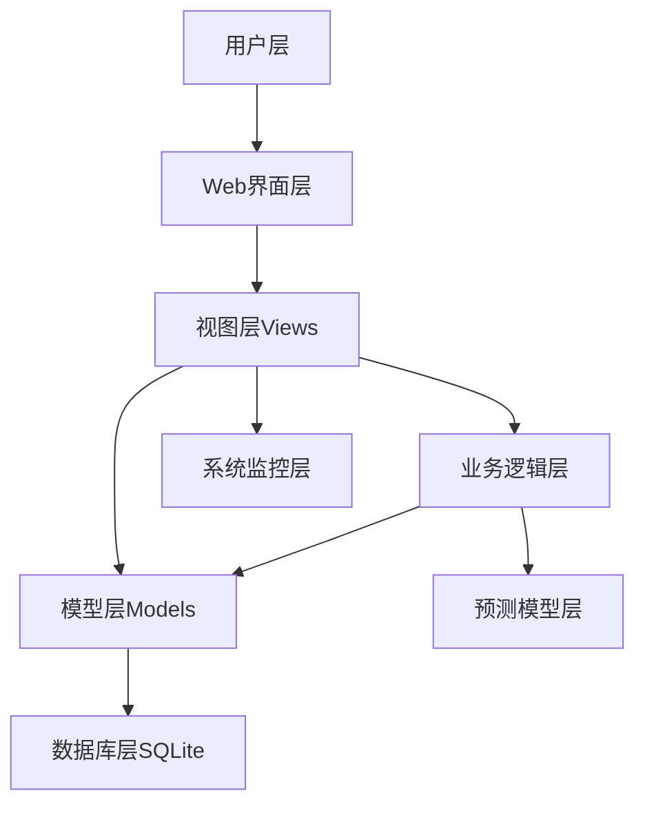
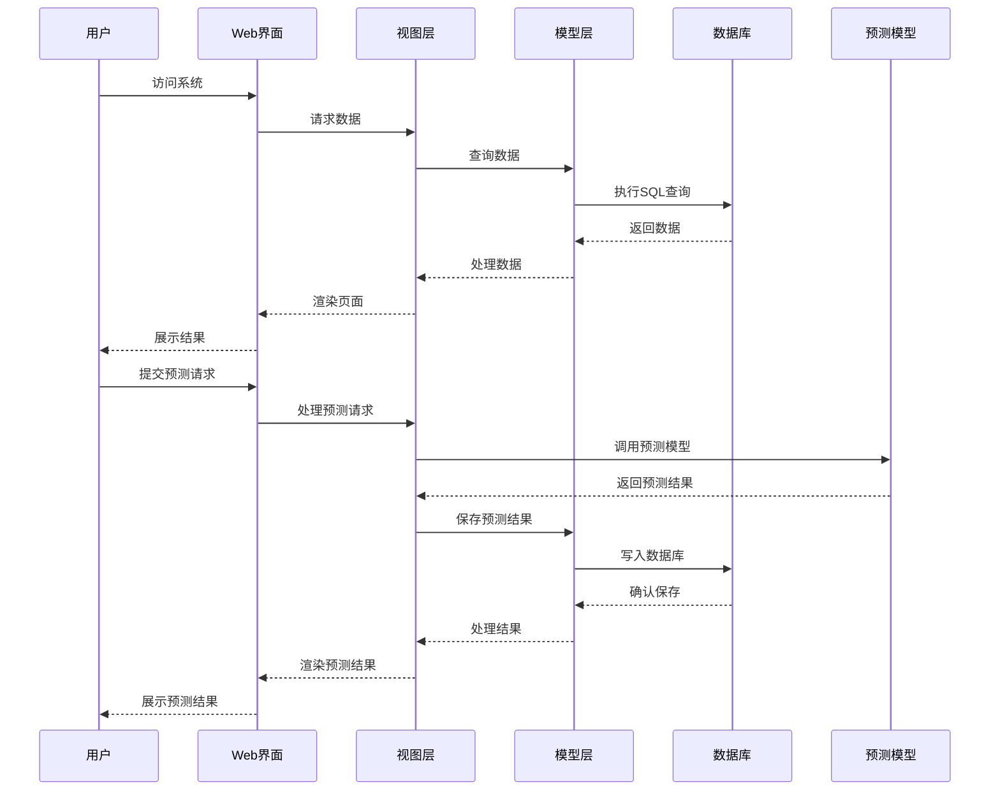
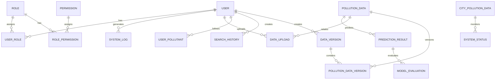

# 污染监测与预测系统技术文档

## 1. 系统概述

本系统是一个基于Django的污染监测与预测系统，旨在提供全面的空气质量监测、分析和预测功能。系统集成了历史数据管理、多模型预测、城市污染排名、系统监控等核心功能，为环保部门和相关研究人员提供直观、高效的污染数据管理工具。

### 1.1 系统架构

系统采用经典的Django MTV架构，分层清晰，易于维护和扩展：



### 1.2 技术栈

| 类别 | 技术/框架 | 版本 | 用途 |
|------|-----------|------|------|
| 后端框架 | Django | 4.2.23 | Web应用框架 |
| 前端技术 | HTML/CSS/JavaScript | - | 页面渲染与交互 |
| 前端框架 | Bootstrap | - | 响应式布局 |
| 数据处理 | pandas | - | 数据读取与处理 |
| 编码检测 | chardet | - | 文件编码自动检测 |
| 机器学习 | scikit-learn | - | 预测模型训练与推理 |
| 数据库 | SQLite | - | 数据存储 |
| 缓存 | Redis | - | 数据缓存 |
| 认证 | JWT | - | API安全认证 |

## 2. 系统功能模块

### 2.1 核心功能模块

#### 2.1.1 监测分析模块

- **污染地图**：可视化展示不同地区的污染情况
- **气象探空图**：提供气象数据与污染关系分析
- **趋势图表**：展示污染物浓度随时间的变化趋势
- **风玫瑰图**：分析风向与污染物分布的关系

#### 2.1.2 数据管理模块

- **数据上传**：支持CSV格式数据批量上传
- **数据版本控制**：管理不同版本的数据集
- **数据导出**：支持将数据导出为CSV格式
- **历史数据查询**：按时间范围和污染物类型查询历史数据

#### 2.1.3 预测功能模块

- **多模型预测**：集成线性回归、神经网络、随机森林等多种预测模型
- **预测评估**：评估不同模型的预测性能
- **批量预测**：支持对未来多日的污染情况进行预测
- **预测历史**：记录和管理历史预测结果

#### 2.1.4 城市污染排名

- **AQI排名**：展示各城市空气质量指数排名
- **污染物详情**：提供各城市详细的污染物浓度数据
- **排名筛选**：支持按不同污染物类型进行排名

#### 2.1.5 系统管理模块

- **用户管理**：创建、编辑、删除用户账号
- **角色权限**：基于RBAC模型的权限管理系统
- **系统监控**：实时监控系统CPU、内存、磁盘等资源使用情况
- **系统日志**：记录系统操作和异常情况

### 2.2 功能流程图



## 3. 数据模型设计

### 3.1 核心数据模型

#### 3.1.1 历史污染数据模型 (PollutionData)

| 字段名 | 数据类型 | 描述 |
|--------|----------|------|
| id | BigAutoField | 主键 |
| date | DateTimeField | 数据采集时间 |
| pm25 | FloatField | PM2.5浓度(μg/m³) |
| pm10 | FloatField | PM10浓度(μg/m³) |
| no2 | FloatField | NO₂浓度(μg/m³) |
| so2 | FloatField | SO₂浓度(μg/m³) |
| o3 | FloatField | O₃浓度(μg/m³) |
| co | FloatField | CO浓度(mg/m³) |
| temperature | FloatField | 温度(℃) |
| humidity | FloatField | 湿度(%) |
| wind_speed | FloatField | 风速(m/s) |
| wind_direction | FloatField | 风向(角度) |
| pressure | FloatField | 气压 |
| precipitation | FloatField | 降水量 |
| is_hidden | BooleanField | 是否隐藏 |

#### 3.1.2 预测结果模型 (PredictionResult)

| 字段名 | 数据类型 | 描述 |
|--------|----------|------|
| id | BigAutoField | 主键 |
| predict_time | DateTimeField | 预测时间 |
| target_date | DateTimeField | 预测目标日期 |
| pm25_pred | FloatField | PM2.5预测值（线性） |
| pm10_pred | FloatField | PM10预测值（线性） |
| no2_pred | FloatField | NO₂预测值（线性） |
| so2_pred | FloatField | SO₂预测值（线性） |
| o3_pred | FloatField | O₃预测值（线性） |
| co_pred | FloatField | CO预测值（线性） |
| pm25_nn_pred | FloatField | PM2.5预测值（神经网络） |
| pm10_nn_pred | FloatField | PM10预测值（神经网络） |
| no2_nn_pred | FloatField | NO₂预测值（神经网络） |
| so2_nn_pred | FloatField | SO₂预测值（神经网络） |
| o3_nn_pred | FloatField | O₃预测值（神经网络） |
| co_nn_pred | FloatField | CO预测值（神经网络） |
| pm25_rf_pred | FloatField | PM2.5预测值（随机森林） |
| pm10_rf_pred | FloatField | PM10预测值（随机森林） |
| no2_rf_pred | FloatField | NO₂预测值（随机森林） |
| so2_rf_pred | FloatField | SO₂预测值（随机森林） |
| o3_rf_pred | FloatField | O₃预测值（随机森林） |
| co_rf_pred | FloatField | CO预测值（随机森林） |
| linear_accuracy | FloatField | 线性回归准确率(%) |
| nn_accuracy | FloatField | 神经网络准确率(%) |
| rf_accuracy | FloatField | 随机森林准确率(%) |
| overall_aqi_pred | IntegerField | 综合AQI预测值 |
| main_pollutant_pred | CharField | 主要污染物预测 |
| aqi_level_pred | CharField | AQI等级预测 |
| linear_rmse | JSONField | 线性模型RMSE |
| nn_rmse | JSONField | 神经网络模型RMSE |

#### 3.1.3 城市污染数据模型 (CityPollutionData)

| 字段名 | 数据类型 | 描述 |
|--------|----------|------|
| id | BigAutoField | 主键 |
| city | CharField | 城市名称 |
| aqi | IntegerField | AQI指数 |
| pm25 | FloatField | PM2.5浓度(μg/m³) |
| pm10 | FloatField | PM10浓度(μg/m³) |
| no2 | FloatField | NO₂浓度(μg/m³) |
| so2 | FloatField | SO₂浓度(μg/m³) |
| o3 | FloatField | O₃浓度(μg/m³) |
| co | FloatField | CO浓度(mg/m³) |
| quality | CharField | 空气质量等级 |
| update_time | DateTimeField | 更新时间 |

#### 3.1.4 系统管理相关模型

| 模型名称 | 主要功能 | 核心字段 |
|----------|----------|----------|
| SystemStatus | 系统状态监控 | cpu_usage, memory_usage, disk_usage, response_time |
| SystemLog | 系统操作日志 | level, action, message, user, ip_address |
| Role | 角色管理 | name, description |
| Permission | 权限管理 | name, codename, description |
| RolePermission | 角色权限关联 | role, permission |
| UserRole | 用户角色关联 | user, role |
| DataVersion | 数据版本管理 | version_name, description, data_count, is_active |
| PollutionDataVersion | 数据版本关联 | data, version |

### 3.2 数据模型关系图



## 4. 核心API接口

### 4.1 数据管理接口

| API路径 | 方法 | 功能描述 | 请求参数 | 响应结构 |
|---------|------|----------|----------|----------|
| `/api/pollution-data` | GET | 获取污染数据列表 | start_date, end_date, pollutants | `{"data": [...], "total": 100}` |
| `/api/pollution-data` | POST | 上传污染数据 | file (CSV) | `{"success": true, "records_processed": 100}` |
| `/api/pollution-data/{id}` | GET | 获取单条污染数据 | id | `{"id": 1, "date": "2023-01-01", ...}` |
| `/api/pollution-data/{id}` | PUT | 更新污染数据 | id, data | `{"success": true, "data": {...}}` |
| `/api/pollution-data/{id}` | DELETE | 删除污染数据 | id | `{"success": true}` |
| `/api/data-versions` | GET | 获取数据版本列表 | - | `{"versions": [...]}` |
| `/api/data-versions` | POST | 创建数据版本 | version_name, description, data_ids | `{"success": true, "version": {...}}` |

### 4.2 预测功能接口

| API路径 | 方法 | 功能描述 | 请求参数 | 响应结构 |
|---------|------|----------|----------|----------|
| `/api/predictions` | GET | 获取预测结果 | start_date, end_date | `{"predictions": [...]}` |
| `/api/predictions` | POST | 生成预测结果 | target_date, model_type | `{"success": true, "prediction": {...}}` |
| `/api/predictions/batch` | POST | 批量生成预测 | start_date, end_date, model_type | `{"success": true, "predictions": [...]}` |
| `/api/model-evaluation` | GET | 获取模型评估结果 | model_type, pollutant | `{"evaluations": [...]}` |
| `/api/model-evaluation/{id}/activate` | POST | 激活模型版本 | id | `{"success": true, "model": {...}}` |

### 4.3 城市污染接口

| API路径 | 方法 | 功能描述 | 请求参数 | 响应结构 |
|---------|------|----------|----------|----------|
| `/api/city-pollution` | GET | 获取城市污染数据 | sort_by, limit | `{"cities": [...]}` |
| `/api/city-pollution/{city}` | GET | 获取单个城市污染数据 | city | `{"city": "北京", "aqi": 120, ...}` |
| `/api/city-pollution/ranking` | GET | 获取城市污染排名 | limit | `{"top_cities": [...], "bottom_cities": [...]}` |

### 4.4 系统管理接口

| API路径 | 方法 | 功能描述 | 请求参数 | 响应结构 |
|---------|------|----------|----------|----------|
| `/api/system/status` | GET | 获取系统状态 | - | `{"cpu_usage": 20.5, "memory_usage": 45.2, ...}` |
| `/api/system/logs` | GET | 获取系统日志 | level, action, start_date, end_date | `{"logs": [...]}` |
| `/api/users` | GET | 获取用户列表 | - | `{"users": [...]}` |
| `/api/users` | POST | 创建用户 | username, password, email | `{"success": true, "user": {...}}` |
| `/api/users/{id}` | PUT | 更新用户信息 | id, data | `{"success": true, "user": {...}}` |
| `/api/users/{id}` | DELETE | 删除用户 | id | `{"success": true}` |
| `/api/roles` | GET | 获取角色列表 | - | `{"roles": [...]}` |
| `/api/roles` | POST | 创建角色 | name, description | `{"success": true, "role": {...}}` |
| `/api/permissions` | GET | 获取权限列表 | - | `{"permissions": [...]}` |

## 5. 系统配置与部署

### 5.1 开发环境配置

1. **环境要求**：
   - Python 3.8+
   - Django 4.2.23+
   - SQLite 3+
   - 推荐使用虚拟环境

2. **安装步骤**：
   ```bash
   # 克隆项目
   git clone <repository_url>
   cd pollution_project
   
   # 创建虚拟环境
   python -m venv venv
   
   # 激活虚拟环境
   # Windows
   venv\Scripts\activate
   # Linux/Mac
   source venv/bin/activate
   
   # 安装依赖
   pip install -r requirements.txt
   
   # 初始化数据库
   python manage.py migrate
   
   # 创建超级用户
   python manage.py createsuperuser
   
   # 启动开发服务器
   python manage.py runserver
   ```

3. **初始数据**：
   - 运行 `python initialize_users.py` 创建默认用户
   - 运行 `python create_city_pollution_model.py` 初始化城市污染数据
   - 运行 `python init_rbac.py` 初始化角色权限数据

### 5.2 生产环境部署

1. **环境要求**：
   - Python 3.8+
   - 生产级数据库（如PostgreSQL、MySQL）
   - Web服务器（如Nginx、Apache）
   - 应用服务器（如Gunicorn、uWSGI）

2. **部署步骤**：
   ```bash
   # 克隆项目到生产服务器
   git clone <repository_url> /path/to/project
   cd /path/to/project
   
   # 创建虚拟环境
   python -m venv venv
   source venv/bin/activate
   
   # 安装依赖
   pip install -r requirements.txt
   
   # 配置环境变量
   export DEBUG=False
   export SECRET_KEY=<your-secret-key>
   export DATABASE_URL=<your-database-url>
   
   # 收集静态文件
   python manage.py collectstatic
   
   # 运行数据库迁移
   python manage.py migrate
   
   # 使用Gunicorn启动应用
   gunicorn pollution_project.wsgi:application --bind 0.0.0.0:8000
   ```

3. **Nginx配置示例**：
   ```nginx
   server {
       listen 80;
       server_name example.com;
       
       location / {
           proxy_pass http://127.0.0.1:8000;
           proxy_set_header Host $host;
           proxy_set_header X-Real-IP $remote_addr;
           proxy_set_header X-Forwarded-For $proxy_add_x_forwarded_for;
           proxy_set_header X-Forwarded-Proto $scheme;
       }
       
       location /static/ {
           alias /path/to/project/static/;
       }
       
       location /media/ {
           alias /path/to/project/media/;
       }
   }
   ```

## 6. 系统监控与维护

### 6.1 系统监控

- **实时监控**：系统自动记录CPU、内存、磁盘使用率等系统指标
- **监控频率**：默认每5分钟记录一次系统状态
- **异常告警**：当系统指标超过阈值时，自动记录告警日志
- **监控面板**：提供可视化的系统状态监控面板

### 6.2 日志管理

- **日志级别**：info、warning、error、critical
- **日志分类**：登录、数据上传、模型训练、系统设置等
- **日志查询**：支持按级别、操作类型、时间范围查询
- **日志保留**：默认保留30天的系统日志

### 6.3 常见问题与解决方案

| 问题 | 可能原因 | 解决方案 |
|------|----------|----------|
| 数据上传失败 | 文件格式不正确 | 确保上传CSV文件，且格式符合要求 |
| 预测模型训练失败 | 训练数据不足 | 确保有足够的历史数据用于模型训练 |
| 系统响应缓慢 | 数据库查询优化不足 | 添加索引，优化查询语句 |
| 内存使用过高 | 数据缓存过大 | 调整缓存策略，定期清理缓存 |
| 权限错误 | 用户权限不足 | 检查用户角色和权限配置 |

## 7. 安全措施

### 7.1 认证与授权

- **JWT认证**：API接口使用JWT令牌进行身份验证
- **RBAC权限模型**：基于角色的访问控制，细粒度权限管理
- **密码加密**：用户密码使用Django内置的密码加密机制
- **会话管理**：定期清理无效会话，防止会话固定攻击

### 7.2 数据安全

- **输入验证**：对所有用户输入进行严格验证，防止注入攻击
- **CSRF保护**：启用Django的CSRF保护机制
- **XSS防护**：对输出到页面的数据进行转义处理
- **数据备份**：定期备份数据库，防止数据丢失

### 7.3 网络安全

- **HTTPS支持**：生产环境建议使用HTTPS协议
- **IP限制**：可配置允许访问系统的IP范围
- **请求速率限制**：防止暴力破解和DDoS攻击

## 8. 系统扩展与未来规划

### 8.1 功能扩展

- **实时数据采集**：集成IoT设备，实现实时污染数据采集
- **多语言支持**：添加英文等多语言界面
- **移动端适配**：开发移动应用或响应式移动端界面
- **高级分析功能**：添加机器学习模型自动调参、深度学习模型支持
- **数据可视化增强**：集成更多可视化图表类型

### 8.2 性能优化

- **数据库优化**：使用PostgreSQL等高性能数据库
- **缓存策略**：优化Redis缓存策略，提高数据访问速度
- **异步处理**：使用Celery处理耗时任务，如模型训练、数据导入
- **负载均衡**：支持多实例部署，实现负载均衡

### 8.3 集成与对接

- **第三方API**：对接气象局、环保部门等第三方数据API
- **数据共享平台**：构建数据共享接口，支持与其他系统的数据交换
- **报表生成**：自动生成定期污染报告

## 9. 总结

本系统是一个功能完善、架构清晰的污染监测与预测系统，具有以下特点：

1. **全面的功能**：覆盖了污染数据监测、分析、预测、管理等各个方面
2. **先进的技术**：集成了多种机器学习模型，提供精准的污染预测
3. **完善的权限管理**：基于RBAC模型的权限系统，确保数据安全
4. **良好的扩展性**：模块化设计，易于功能扩展和技术升级
5. **用户友好**：直观的界面设计，便捷的操作流程

系统通过提供准确的污染数据和预测结果，为环保决策提供科学依据，有助于改善空气质量，保护公众健康。未来，系统将继续优化性能，扩展功能，为环保事业做出更大贡献。

## 10. 附录

### 10.1 数据字典

| 术语 | 解释 |
|------|------|
| AQI | 空气质量指数，用于描述空气质量状况的综合指标 |
| PM2.5 | 细颗粒物，直径小于等于2.5微米的颗粒物 |
| PM10 | 可吸入颗粒物，直径小于等于10微米的颗粒物 |
| NO₂ | 二氧化氮，主要来自燃烧过程的污染物 |
| SO₂ | 二氧化硫，主要来自化石燃料燃烧的污染物 |
| O₃ | 臭氧，光化学烟雾的主要成分 |
| CO | 一氧化碳，无色无味的有毒气体 |
| RBAC | 基于角色的访问控制，一种权限管理模型 |
| JWT | JSON Web Token，一种用于身份验证的令牌 |

### 10.2 快捷键与操作指南

| 功能 | 操作 |
|------|------|
| 快速搜索 | 按Ctrl+K打开搜索框 |
| 批量操作 | 选择多个项目后，点击批量操作按钮 |
| 数据导出 | 在数据列表页面，点击导出按钮 |
| 模型训练 | 在模型管理页面，选择数据集和模型类型，点击训练按钮 |
| 版本切换 | 在数据版本管理页面，选择版本并点击激活按钮 |


---

*文档版本：v1.0*
*更新时间：2026-02-17*
